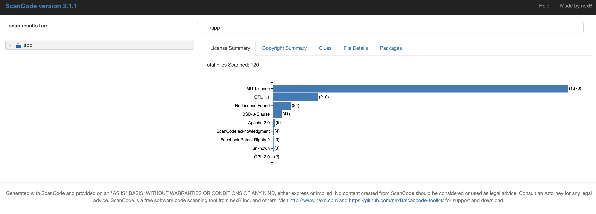

# ScanCode-docker

[nexB ScanCode](https://github.com/nexB/scancode-toolkit) is containerized

## Steps to run:

- Pull the image or build

  ```
  docker pull rmkanda/nexb-scancode
  ```

  OR

  ```
  git clone https://github.com/rmkanda/ScanCode-docker.git
  cd ScanCode-docker
  docker build . -t rmkanda/nexb-scancode
  ```

- Naviagte to your application directory
- Run the scan
  ```bash
  docker run -ti -v `pwd`:'/app/' rmkanda/nexb-scancode:latest
  ```
- Output will be stored in results.html
- Open results.html 
